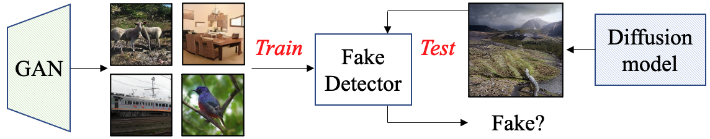

# Detecting fake images

**Towards Universal Fake Image Detectors that Generalize Across Generative Models** <br>
[Utkarsh Ojha*](https://utkarshojha.github.io/), [Yuheng Li*](https://yuheng-li.github.io/), [Yong Jae Lee](https://pages.cs.wisc.edu/~yongjaelee/) <br>
(*Equal contribution) <br>
CVPR 2023

[[Project Page](https://utkarshojha.github.io/universal-fake-detection/)] [[Paper](https://arxiv.org/abs/2302.10174)]

<p align="center">
    <a href="https://utkarshojha.github.io/universal-fake-detection/">></a> <br>
    Using images from one type of generative model (e.g., GAN), detect fake images from other <i>breeds</i> (e.g., Diffusion models)
</p>

## Contents

- [Setup](#setup)
- [Pretrained model](#weights)
- [Data](#data)
- [Evaluation](#evaluation)
- [Training](#training)


## Setup 

1. Clone this repository 
```bash
git clone https://github.com/Yuheng-Li/UniversalFakeDetect
cd UniversalFakeDetect
```

2. Install the necessary libraries
```bash
pip install torch torchvision
```

## Data

- Of the 19 models studied overall (Table 1/2 in the main paper), 11 are taken from a [previous work](https://arxiv.org/abs/1912.11035). Download the test set, i.e., real/fake images for those 11 models given by the authors from [here](https://drive.google.com/file/d/1z_fD3UKgWQyOTZIBbYSaQ-hz4AzUrLC1/view) (dataset size ~19GB).
- Download the file and unzip it in `datasets/test`. You could also use the bash scripts provided by the authors, as described [here](https://github.com/PeterWang512/CNNDetection#download-the-dataset) in their code repository.
- This should create a directory structure as follows:
```

datasets
└── test					
      ├── progan	
      │── cyclegan   	
      │── biggan
      │      .
      │      .
	  
```
- Each directory (e.g., progan) will contain real/fake images under `0_real` and `1_fake` folders respectively.
- Dataset for the diffusion models (e.g., LDM/Glide) can be found [here](https://drive.google.com/file/d/1FXlGIRh_Ud3cScMgSVDbEWmPDmjcrm1t/view?usp=drive_link). Note that in the paper (Table 2/3), we had reported the results over 10k randomly sampled images. Since providing that many images for all the domains will take up too much space, we are only releasing 1k images for each domain; i.e., 1k images fake images and 1k real images for each domain (e.g., LDM-200).
- Download and unzip the file into `./diffusion_datasets` directory.


## Evaluation
 
- You can evaluate the model on all the dataset at once by running:
```bash
python validate.py  --arch=CLIP:ViT-L/14   --ckpt=pretrained_weights/fc_weights.pth   --result_folder=clip_vitl14 
```

- You can also evaluate the model on one generative model by specifying the paths of real and fake datasets
```bash
python validate.py  --arch=CLIP:ViT-L/14   --ckpt=pretrained_weights/fc_weights.pth   --result_folder=clip_vitl14  --real_path datasets/test/progan/0_real --fake_path datasets/test/progan/1_fake
```

Note that if no arguments are provided for `real_path` and `fake_path`, the script will perform the evaluation on all the domains specified in `dataset_paths.py`.

- The results will be stored in `results/<folder_name>` in two files: `ap.txt` stores the Average Prevision for each of the test domains, and `acc.txt` stores the accuracy (with 0.5 as the threshold) for the same domains.

## Training

- Our main model is trained on the same dataset used by the authors of [this work](https://arxiv.org/abs/1912.11035). Download the official training dataset provided [here](https://drive.google.com/file/d/1iVNBV0glknyTYGA9bCxT_d0CVTOgGcKh/view) (dataset size ~ 72GB). 

- Download and unzip the dataset in `datasets/train` directory. The overall structure should look like the following:
```
datasets
└── train			
      └── progan			
           ├── airplane
           │── bird
           │── boat
           │      .
           │      .
```
- A total of 20 different object categories, with each folder containing the corresponding real and fake images in `0_real` and `1_fake` folders.
- The model can then be trained with the following command:
```bash
python train.py --name=clip_vitl14 --wang2020_data_path=datasets/ --data_mode=wang2020  --arch=CLIP:ViT-L/14  --fix_backbone
```
- **Important**: do not forget to use the `--fix_backbone` argument during training, which makes sure that the only the linear layer's parameters will be trained.

## Acknowledgement

We would like to thank [Sheng-Yu Wang](https://github.com/PeterWang512) for releasing the real/fake images from different generative models. Our training pipeline is also inspired by his [open-source code](https://github.com/PeterWang512/CNNDetection). We would also like to thank [CompVis](https://github.com/CompVis) for releasing the pre-trained [LDMs](https://github.com/CompVis/latent-diffusion) and [LAION](https://laion.ai/) for open-sourcing [LAION-400M dataset](https://laion.ai/blog/laion-400-open-dataset/).

## Citation

If you find our work helpful in your research, please cite it using the following:
```bibtex
@inproceedings{ojha2023fakedetect,
      title={Towards Universal Fake Image Detectors that Generalize Across Generative Models}, 
      author={Ojha, Utkarsh and Li, Yuheng and Lee, Yong Jae},
      booktitle={CVPR},
      year={2023},
}
```
